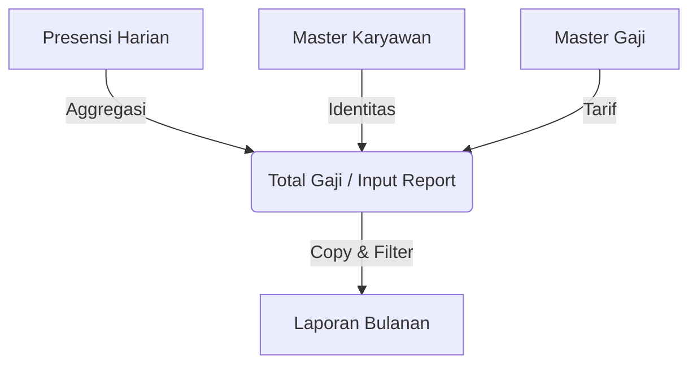

# Konfirmasi Desain Teknis: Laporan Bulanan Pabrik Garut

Dokumen ini dibuat untuk mengonfirmasi pemahaman tim internal mengenai alur data dan logika bisnis yang diterapkan pada modul **Laporan Bulanan Pabrik Garut**.

## 1. Arsitektur Alur Data

Sistem menggunakan pendekatan bertingkat (*tiered approach*) di mana data mengalir dari mentah ke matang, dan laporan akhir hanyalah tampilan dari data yang sudah matang.



## 2. Klarifikasi Sumber Data (Per Kolom)

| Kelompok Kolom | Sumber Data Teknis | Keterangan |
| :--- | :--- | :--- |
| **Identitas**<br>(Kode, Nama, Perusahaan, Divisi) | **Tabel `total_gaji`**<br>*(yang mengambil dari Master Karyawan)* | Identitas bersifat statis per bulan. Jika Master Karyawan tertulis "BORONGAN", maka di sini juga tertulis "BORONGAN". |
| **Statistik Kehadiran**<br>(H, S, I, A, Lembur) | **Tabel `total_gaji`**<br>*(Hasil hitung dari Presensi)* | Laporan Bulanan menerima angka "matang". Tidak menghitung ulang dari presensi mentah. |
| **Nominal Gaji**<br>(Gapok, Tunjangan, Bonus) | **Tabel `total_gaji`** | Hasil perkalian statistik dengan tarif Master Gaji. |

## 3. Konfirmasi Isu "Borongan"

**Pertanyaan:**
Apakah benar jika status di Master Karyawan adalah "BORONGAN", data tidak akan masuk ke Laporan Bulanan meskipun presensi hariannya ada?

**Jawaban: BENAR.**

**Penjelasan Teknis:**
1.  Proses `refresh_total_gaji` mengambil label perusahaan dari Master Karyawan.
2.  Jika Master = "BORONGAN", maka kolom `perusahaan` di `total_gaji` = "BORONGAN".
3.  Proses `sync_garut_laporan_bulanan` memiliki filter eksplisit:
    ```sql
    WHERE perusahaan NOT LIKE '%BORONGAN%'
    ```
4.  Oleh karena itu, data tersebut **sengaja di-exclude** dari Laporan Bulanan Staff dan seharusnya diproses di modul Gaji Borongan.

## 4. Kesimpulan Desain

Laporan Bulanan Pabrik Garut didesain sebagai **Snapshot Statis** dari tabel `total_gaji` yang sudah difilter khusus untuk karyawan Non-Borongan. Laporan ini **bukan** merupakan komposisi dinamis multi-sumber yang menggabungkan presensi harian secara langsung pada saat *runtime*.

---
*Dokumen ini valid per tanggal revisi terakhir kode SQL (Maret 2025).*
